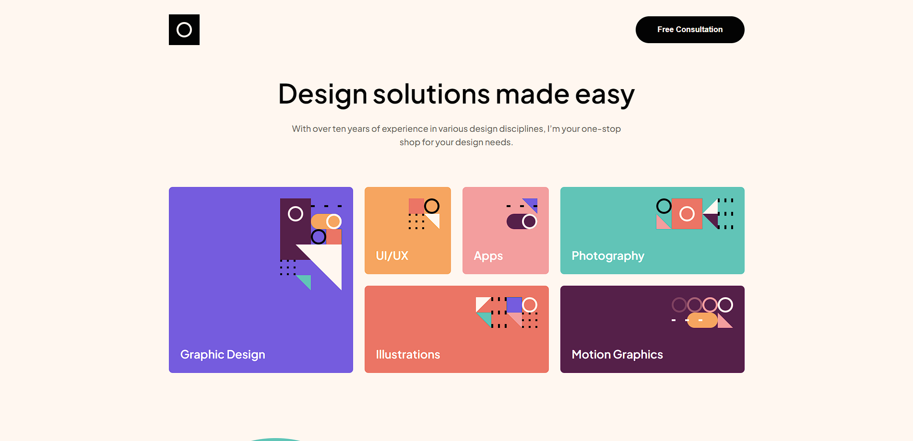

# Frontend Mentor - Easybank landing page solution

This is a solution to the [Easybank landing page challenge on Frontend Mentor](https://www.frontendmentor.io/challenges/easybank-landing-page-WaUhkoDN). Frontend Mentor challenges help you improve your coding skills by building realistic projects. 

### Screenshot

### Links

- Solution URL: [Add solution URL here]([https://your-solution-url.com](https://www.frontendmentor.io/solutions/singlepage-design-portfolio-Oez_1CT5m3))
- Live Site URL: [([https://your-live-site-url.com](https://schifferedson.github.io/Single-Page-Design-Portfolio/))]

## My process

### Built with

- Semantic HTML5 markup
- CSS custom properties
- Flexbox
- CSS Grid

### What I learned

I learned how to use the css root to store colors and not repeat them in the code, in addition to practicing javascript in an attempt to create a slide. It wasn't very good but it's progress in my learning. 😁

**Note: Delete this note and the content within this section and replace with your own learnings.**

### Continued development

Use this section to outline areas that you want to continue focusing on in future projects. These could be concepts you're still not completely comfortable with or techniques you found useful that you want to refine and perfect.

## Author

- Frontend Mentor - [@schifferedson]([https://www.frontendmentor.io/profile/yourusername](https://www.frontendmentor.io/profile/schifferedson))
- email - (schiffer1212@gmail.com)
